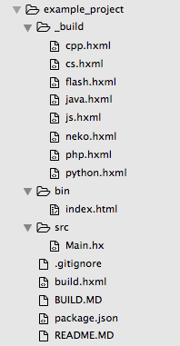

#HxGenerate


I start lots of little [Haxe](http://www.haxe.org) projects and because OSX doesn't have a proper IDE, I used to use HIDE for this.  
It seem silly to use an unfinished editor (HIDE) and generate folder structure I will later open in [Sublime Text](https://www.sublimetext.com/) or [VSCode](https://code.visualstudio.com/)...

So this project will fix that: I now generate Haxe project folders with HxGenerate.


## how to use:

```
neko hxgenerate -cd 'path/to/folder' -name 'awsome project' -license 'none' -author 'that would be you' -target 'neko'

	-help : show this help
	-cd or -folder : path to project folder
	-name : project Name (name also used for the name of the generate folder)
	-license : project license (MIT, etc)
	-author : project author (you?)
	-target : project target (js, cpp, flash, neko, etc)

```

## What does it generate?

I have added an [example folder](bin/example_project) to show what it will generate.

You generate the folder like this:

```
neko hxgenerate -cd '/Volumes/path/to/folder' -name 'Example project' -author 'Matthijs Kamstra aka[mck]' -target 'js' -website 'http://www.matthijskamstra.nl/'
```

It will generate a Haxe JavaScript project (folder). 



- `_build`-folder
 	- in this folder build `.hxml` for all targets (just in case you want to switch)
- `bin`-folder
	- export folder with an `index.html` (bootstrap and Jquery included)
- `src`-folder
	- source folder with a `Main.hx` class
- `.gitignore` that ignores default the `Build.md`
- `build.hxml` with all the best practices for a build file in there
	- [Sublime Text](https://www.sublimetext.com/) and [VSCode](https://code.visualstudio.com/) both use this specific name as a build file
- `BUILD.MD` a little help with commandline code to jumpstart your project
	- build once with `haxe build.hxml`
	- use nekotools server (js only)
	- automate using NPM 
- `package.json` for NPM (used for automated build)
- `README.MD` with some values used when generating the folder 